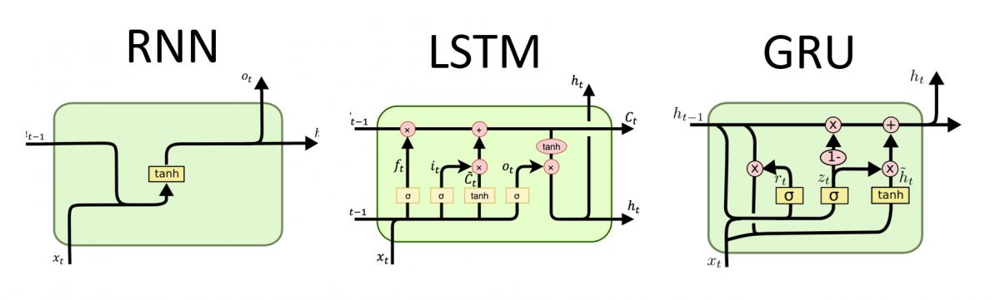

## RNN 與 自然語言處理|報告主題
- 需涵蓋底下`1`到`5`內容(未編號者(加分項):可不做)
- `1`.NLP研究主題
  - https://www.geeksforgeeks.org/natural-language-processing-nlp-tutorial/ 
- Text Preprocessing(文本預處理) | Text Feature Engineering
  - [Text Preprocessing(文本預處理)基本觀念](TextPreprocessing.md)
  - [使用NLTK](IMDb文本分類_NLTK.md)
    - 移除Stop Words（停用詞）
    - Text Normalization ==> `詞幹提取(stemming)`和`詞形還原(lemmatization)`
- `2`.[Text Representation or Text Embedding Techniques(word ==> vector) ](NLP_WordVector.md)
  - https://medium.com/ml-note/word-embedding-3ca60663999d
  - Bag of Word
  - TF-IDF
  - Word Embedding 
- `3`.RNN model  ==> The Problem of Long-Term Dependencies
  - Vanilla RNN
  - LSTM|Long Short-Term Memory|長短期記憶(1997)
    - 👍👍 [Understanding LSTM Networks(2015)](https://colah.github.io/posts/2015-08-Understanding-LSTMs/)
    - https://ithelp.ithome.com.tw/articles/10193924 
  - GRU | Gated Recurrent Unit(2014)
    - https://zhuanlan.zhihu.com/p/20310288990
    - https://ithelp.ithome.com.tw/articles/10194201 
  - https://www.geeksforgeeks.org/rnn-vs-lstm-vs-gru-vs-transformers/
- `4`.從seq2seq model到Transformer
  - Neural Machine Translation 與 seq2seq model
    - 2014 [Sequence to Sequence Learning with Neural Networks](https://arxiv.org/abs/1409.3215)
    - 2014 [Learning Phrase Representations using RNN Encoder–Decoder for Statistical Machine Translation](https://emnlp2014.org/papers/pdf/EMNLP2014179.pdf)
    - https://research.google/blog/a-neural-network-for-machine-translation-at-production-scale/
  - Attention
    - 2014 [Neural Machine Translation by Jointly Learning to Align and Translate](https://arxiv.org/abs/1409.0473)
    - 2015 [Effective Approaches to Attention-based Neural Machine Translation](https://arxiv.org/abs/1508.04025)
    - 👍[Visualizing A Neural Machine Translation Model (Mechanics of Seq2seq Models With Attention)](https://jalammar.github.io/visualizing-neural-machine-translation-mechanics-of-seq2seq-models-with-attention/)
  - 2017 [Transformer](Transformer.md)
    - 👍👍👍[Attention Is All You Need](https://arxiv.org/abs/1706.03762)
    - [[1607.06450] Layer Normalization | Jimmy Lei Ba, Jamie Ryan Kiros, Geoffrey E. Hinton](https://arxiv.org/abs/1607.06450)
    - 👍[The Illustrated Transformer](https://jalammar.github.io/illustrated-transformer/)
- [Pre-Trained Language Models](Pre-Trained_Language_Models.md) ==> LLM
  - **2018 BERT Bidirectional Encoder Representations from Transforme**
  - 2018 GPT
- `5`.範例應用NLP|文本分類(TEXT Classofication)
  - [IMDb文本分類](IMDb文本分類.md)
    - Sentiment Analysis 情緒分析 ==> 負評 vs 正評
  - 以內容為基礎的推薦系統

## 教科書相關章節
#### 教科書:第15章Processing Sequences Using RNNs and CNNs ==> [時間序列分析](時間序列分析.md)
- Recurrent Neurons and Layers
- Training RNNs
- Forecasting a Time Series
- Handling Long Sequences

#### 教科書:第16章
- Generating Shakespearean Text Using a Character RNN
- Sentiment Analysis
- An Encoder–Decoder Network for Neural Machine Translation
- Attention Mechanisms
- An Avalanche of Transformer Models
- Vision Transformers
- Hugging Face’s Transformers Library

## 延伸閱讀
- [Natural Language Processing in Action, Second Edition(2025)](https://learning.oreilly.com/library/view/natural-language-processing/9781617299445/)
- [Natural Language Processing with Transformers, Revised Edition(2022)](https://learning.oreilly.com/library/view/natural-language-processing/9781098136789/)
- [Python Natural Language Processing Cookbook - Second Edition(2024)](https://learning.oreilly.com/library/view/python-natural-language/9781803245744/)
- [Practical Natural Language Processing(2020)](https://learning.oreilly.com/library/view/practical-natural-language/9781492054047/)
- 傳統NLP ==> NLTK, spaCy, sklearn, and gensim
  - [Python Natural Language Processing Cookbook(2021)](https://learning.oreilly.com/library/view/python-natural-language/9781838987312/)
  - [Natural Language Processing: Python and NLTK(2016)](https://learning.oreilly.com/library/view/natural-language-processing/9781787285101/) 

