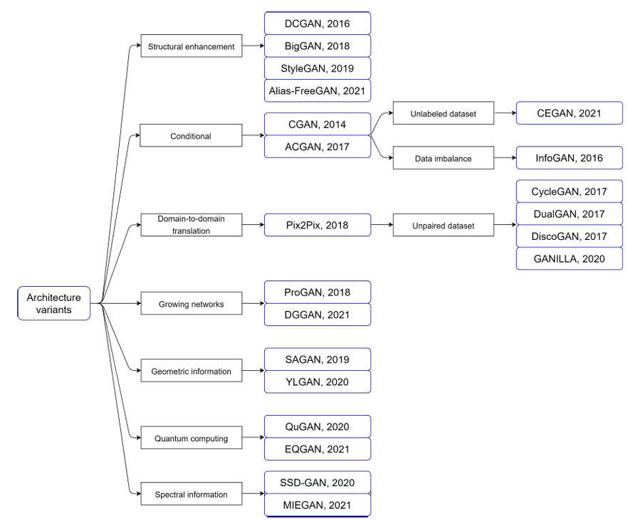

## Awesome GAN
- https://github.com/nightrome/really-awesome-gan
- https://github.com/nashory/gans-awesome-applications
- https://github.com/Faldict/awesome-GAN
- https://github.com/dongb5/GAN-Timeline
- https://github.com/hindupuravinash/the-gan-zoo
- https://github.com/hindupuravinash/the-gan-zoo

## review
- [A survey on GANs for computer vision: Recent research, analysis and taxonomy](https://arxiv.org/abs/2203.11242)
- [A Survey on Generative Adversarial Networks: Variants, Applications, and Training](https://arxiv.org/abs/2006.05132)
- [Generative Adversarial Networks (GANs Survey): Challenges, Solutions, and Future Directions](https://arxiv.org/abs/2005.00065)
- [Generative Adversarial Networks for photo to Hayao Miyazaki style cartoons](https://arxiv.org/abs/2005.07702)
- [A Survey on the Application of Generative Adversarial Networks in Cybersecurity: Prospective, Direction and Open Research Scopes](https://arxiv.org/abs/2407.08839)
- [Generative adversarial networks in time series: A survey and taxonomy](https://arxiv.org/abs/2107.11098)
- [Generative Adversarial Networks for Malware Detection: a Survey](https://arxiv.org/abs/2302.08558)
- [A Survey on Malware Detection with Graph Representation Learning](https://arxiv.org/abs/2303.16004)
- [On Deep Learning in Password Guessing, a Survey](https://arxiv.org/abs/2208.10413)
- [Stegomalware: A Systematic Survey of MalwareHiding and Detection in Images, Machine LearningModels and Research Challenges](https://arxiv.org/abs/2110.02504)
- [Video Generative Adversarial Networks: A Review](https://arxiv.org/abs/2011.02250)
- [A review of Generative Adversarial Networks (GANs) and its applications in a wide variety of disciplines -- From Medical to Remote Sensing](https://arxiv.org/abs/2110.01442)
- [Generative Adversarial Networks for Image Super-Resolution: A Survey](https://arxiv.org/abs/2204.13620)
- [A survey on text generation using generative adversarial networks](https://arxiv.org/abs/2212.11119)
- [Deep Generative Models on 3D Representations: A Survey](https://arxiv.org/abs/2210.15663)
- [Synthesizing Iris Images using Generative Adversarial Networks: Survey and Comparative Analysis](https://arxiv.org/abs/2404.17105)
- [Deepfake Generation and Detection: A Benchmark and Survey](https://arxiv.org/abs/2403.17881)
- [Transformer-based Generative Adversarial Networks in Computer Vision: A Comprehensive Survey](https://arxiv.org/abs/2302.08641)
- [A survey of synthetic data augmentation methods in computer vision](https://arxiv.org/abs/2411.09955)
- [A Survey on Super Resolution for video Enhancement Using GAN](https://arxiv.org/abs/2312.16471)
- [A Chronological Survey of Theoretical Advancements in Generative Adversarial Networks for Computer Vision](https://arxiv.org/abs/2311.00995)
- [GANs Conditioning Methods: A Survey](https://arxiv.org/abs/2408.15640)

## 歷史發展與模型
- GAN(2014)
- CGANs | Conditional Generative Adversarial Networks
- 訓練GAN的難處: 模式崩潰
  - problem of JS散度(Jensen–Shannon divergence) ==> Training ==>
    - https://blog.csdn.net/weixin_44441131/article/details/105878383
    - https://blog.csdn.net/weixin_44441131/article/details/105878383 
  - 解決方式:
  - [WGAN == Wasserstein GAN(2017)](https://arxiv.org/abs/1701.07875)
    - [GAN Lecture 6 (2018): WGAN, EBGAN](https://www.youtube.com/watch?v=3JP-xuBJsyc)
    - 使用Wasserstein divergence
  - [Energy-based Generative Adversarial Network(2016)](https://arxiv.org/abs/1609.03126)
- DCGAN(2015)
  - [Deep Convolutional Generative Adversarial Network](https://www.tensorflow.org/tutorials/generative/dcgan) 
- [Progressive Growing of GANs for Improved Quality, Stability, and Variation](https://arxiv.org/abs/1710.10196)
- StyleGAN |Style Generative Adversarial Network(2018) 
  - [A Style-Based Generator Architecture for Generative Adversarial Networks](https://arxiv.org/abs/1812.04948) 
- StyleGAN2 (2019)
  - ArXiv: https://arxiv.org/abs/1912.04958
  - Video: https://youtu.be/c-NJtV9Jvp0
  - TensorFlow implementation: https://github.com/NVlabs/stylegan2

