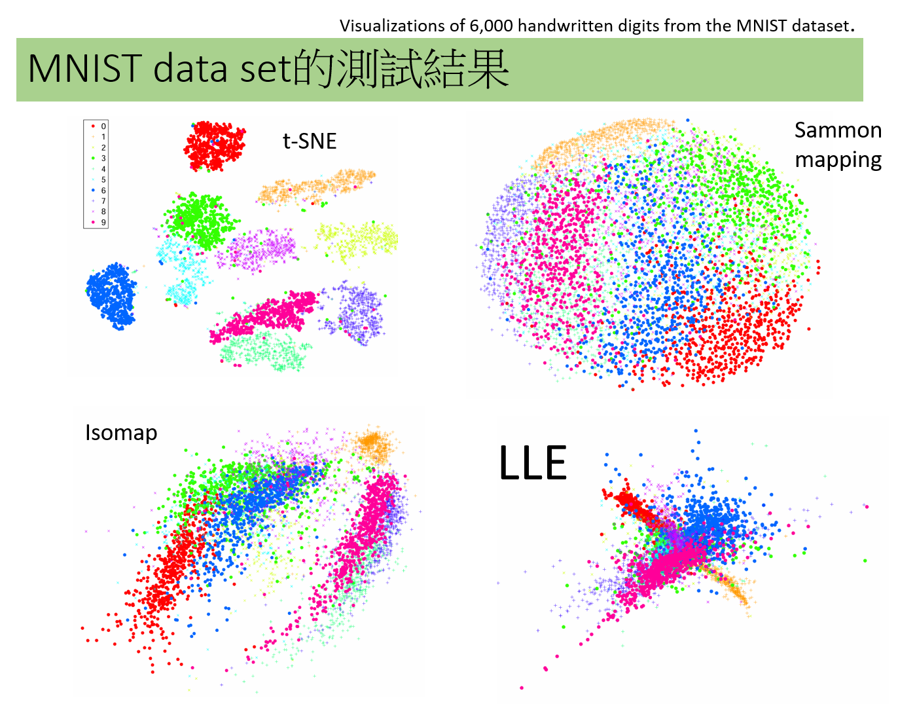

# t-distributed stochastic neighbor embedding (t-SNE)
- 論文 [Visualizing data using t-SNE](https://www.jmlr.org/papers/volume9/vandermaaten08a/vandermaaten08a.pdf) | L.v.d. Maaten, G. Hinton. |Journal of Machine Learning Research, Vol 9(Nov), pp. 2579—2605. 2008
- https://www.mropengate.com/2019/06/t-sne.html
- https://zhuanlan.zhihu.com/p/148170862

## 原理
- 機器學習_學習筆記系列(78)：t-隨機鄰近嵌入法(t-distributed stochastic neighbor embedding)
- 把原本資料點和點之間的`歐幾里得距離`，改成以`機率`的形式來表示
- 高維分佈(Normal Distribution) ==> 低微分佈(Normal Distribution==> 可改用 t-distribution) 
- t-SNE最小化了兩個分佈之間關於嵌入點位置的Kullback-Leibler（KL)散度
- 使用梯度下降的方法來解
- scikit-learn implements t-SNE with both exact solutions and the Barnes-Hut approximation.

## 手把手實作
## 測試
