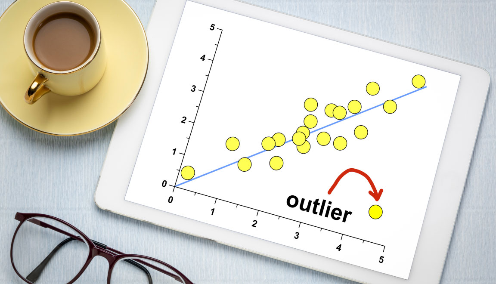
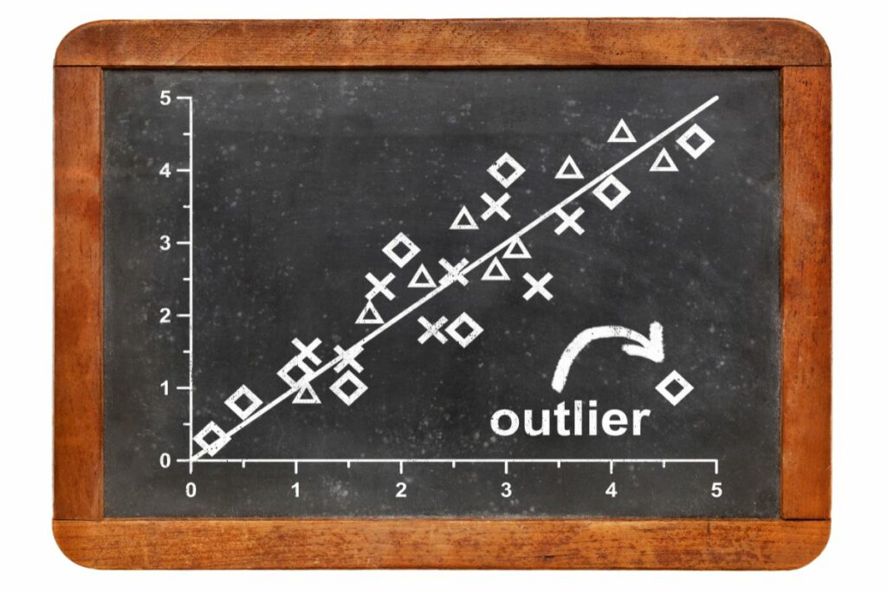

# [Anomaly detection](https://en.wikipedia.org/wiki/Anomaly_detection)|  Novelty Detection | Outlier Detection 孤立子偵測 

#### 分析資料集
- [Credit Card Fraud Detection | Kaggle](https://www.kaggle.com/datasets/mlg-ulb/creditcardfraud)
  - 通過利用信用卡的歷史交易資料，進行機器學習，構建信用卡反欺詐預測模型，提前發現客戶信用卡被盜刷的事件。
  - 資料集介紹
    - Credit Card Fraud Detection資料集包含由歐洲持卡人於2013年9月使用信用卡進行交的資料。
    - 此資料集顯示兩天內發生的交易，其中284,807筆交易中有492筆被盜刷。
    - 資料集非常不平衡，積極的類別（被盜刷）占所有交易的0.172％。
    - 資料集僅包含作為 PCA 轉換結果的數值輸入變數。
    - 遺憾的是，由於機密性問題，我們無法提供有關數據的原始特徵和更多背景資訊。
    - 30個特徵 + 1個答案變數'Class' ==>欺詐的情況下取值 1，否則取值 0
      - 功能 V1、V2、...V28 是使用 PCA 獲得的主成分，唯一未使用 PCA 轉換的特徵是 'Time' 和 'Amount'。
      - 『Time』 包含數據集中每個事務與第一個事務之間經過的秒數。
      - 'Amount' 是交易金額，此功能可用於依賴於成本的學習。
    - 鑒於類別不平衡比率，我們建議使用精度-`召回率曲線下面積(AUPRC)`來測量準確性。混淆矩陣準確性對於不平衡分類沒有意義。
    - 更新（2021 年 3 月 5 日）
      - 交易數據模擬器已作為信用卡欺詐檢測機器學習實用手冊的一部分發佈
        - [Reproducible Machine Learning for Credit Card Fraud detection - Practical handbook](https://fraud-detection-handbook.github.io/fraud-detection-handbook/Foreword.html) 
      - 該數據集是在 Worldline 和 ULB（布魯塞爾自由大學）機器學習小組 （http://mlg.ulb.ac.be） 關於大數據挖掘和欺詐檢測的研究合作期間收集和分析的。
有關相關主題的當前和過去專案的更多詳細資訊，請訪問 https://www.researchgate.net/project/Fraud-detection-5 和 DefeatFraud 專案頁面

- 分析範例
  - https://github.com/Mahadevan0507/Credit-Card-Fraud-Detection
  - https://github.com/anmitsis/Credit-Card-Fraud-Detection/tree/main

#### Local Outlier Factor (LOF) 2000
- 論文 [LOF: Identifying Density-Based Local Outliers ](https://www.dbs.ifi.lmu.de/Publikationen/Papers/LOF.pdf) 
- [機器學習_學習筆記系列(96)：區域性異常因子(Local Outlier Factor)](https://tomohiroliu22.medium.com/%E6%A9%9F%E5%99%A8%E5%AD%B8%E7%BF%92-%E5%AD%B8%E7%BF%92%E7%AD%86%E8%A8%98%E7%B3%BB%E5%88%97-96-%E5%8D%80%E5%9F%9F%E6%80%A7%E7%95%B0%E5%B8%B8%E5%9B%A0%E5%AD%90-local-outlier-factor-a141c2450d4a)
- 官方範例[Outlier detection with Local Outlier Factor (LOF)](https://scikit-learn.org/stable/auto_examples/neighbors/plot_lof_outlier_detection.html#:~:text=The%20Local%20Outlier%20Factor%20(LOF,lower%20density%20than%20their%20neighbors.))

#### 孤立森林(Isolation Forest)2008 
- [論文](https://cs.nju.edu.cn/zhouzh/zhouzh.files/publication/icdm08b.pdf?q=isolation-forest)
- [WIKI](https://en.wikipedia.org/wiki/Isolation_forest) 
- [sklearn.ensemble.IsolationForest](https://scikit-learn.org/stable/modules/generated/sklearn.ensemble.IsolationForest.html)
  - from sklearn.ensemble import IsolationForest
  - X = [[-1.1], [0.3], [0.5], [100]]
  - clf = IsolationForest(random_state=0).fit(X)
  - clf.predict([[0.1], [0], [90]])
- [Anomaly detection using Isolation Forest – A Complete Guide](https://www.analyticsvidhya.com/blog/2021/07/anomaly-detection-using-isolation-forest-a-complete-guide/)

#### 相關套件
- PyOD套件 2019
  - [PyOD: A Python Toolbox for Scalable Outlier Detection]()  
- ADBench 2022
  - [ADBench: Anomaly Detection Benchmark(2022)](https://arxiv.org/abs/2206.09426)  [GITHUB](https://github.com/Minqi824/ADBench)

